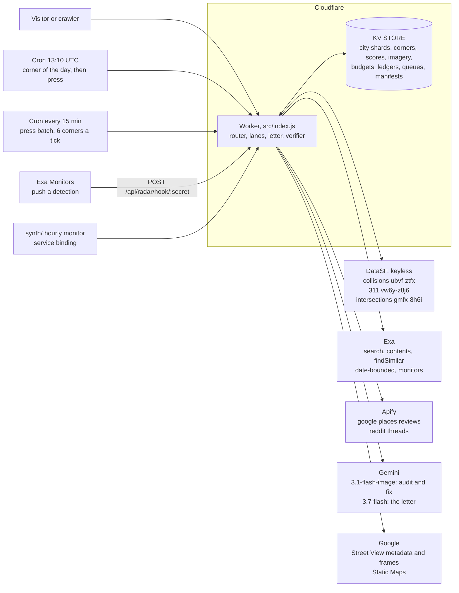

# StreetCred

- **Live site:** https://streetcred.thealexschroeder.workers.dev
- **Demo video:** not recorded yet. The link lands in [Demo video](#demo-video) below, with the shot list.
- **Source:** https://github.com/alejandro-publius/streetcred

**Every claim about a dangerous corner, graded and traced to its source, ending in a picture of the fix and a letter to the Supervisor.**


*The audit and the proposed fix, 16th and Mission. The fix is an AI visualization, not a photograph of anything that exists.*

Pick a San Francisco intersection. StreetCred shows what the city's own data records, what the press reports, and what residents say, each claim traceable to where it came from. Then it shows what an automated visual audit finds wrong with the corner, what the fix would look like, and drafts the letter to the correct District Supervisor.

Built in a single 55 minute sprint at Build Club, "Moonlighting with Gemini + Exa", August 17 2026. The git log covers the whole product.

The homepage is the city: every warmed corner on one map, ranked by Danger Index, worst first. Any San Francisco intersection can be typed in and graded on the spot. Each corner lives at its own shareable URL.

## What it does

- **Grades any San Francisco intersection you can name.** Type two cross streets and the page rebuilds around them: Danger Index, letter grade, severity mix, provenance links. [Find your corner](https://streetcred.thealexschroeder.workers.dev/#find).
- **Ranks the whole city, not a shortlist.** Every graded crossing is drawn on one map and listed on one scoreboard, worst first, on [the homepage](https://streetcred.thealexschroeder.workers.dev/).
- **Shows the corner three ways.** The real Street View frame, the same frame with the hazards a Gemini audit actually found marked on it, and an AI visualization of the fix: [16th and Mission](https://streetcred.thealexschroeder.workers.dev/c/16th-mission).
- **Drafts the letter to the correct District Supervisor**, citing the collision counts, the press coverage and the audit findings by name. A draft that fails verification twice is never served.
- **Audits one new corner every morning with nobody present**, and publishes the result even when a lane fails, with that lane in its labelled degraded state.
- **Publishes what the city's press is talking about**, each candidate corner verified against the graded index, with every rejected candidate and its reason on the page: [/watchlist](https://streetcred.thealexschroeder.workers.dev/watchlist).
- **Holds standing Exa monitors open on the city's corridors** and shows what they caught, what the filter threw away, and what it cost: [/radar](https://streetcred.thealexschroeder.workers.dev/radar).
- **Reports its own uptime and its own spending**, from the providers' own figures rather than its own estimates: [/status](https://streetcred.thealexschroeder.workers.dev/status).
- **Writes down the arithmetic and the limits in full**: [/methodology](https://streetcred.thealexschroeder.workers.dev/methodology), with every grade movement at [/changes](https://streetcred.thealexschroeder.workers.dev/changes) and every autonomous decision at [/watchdog](https://streetcred.thealexschroeder.workers.dev/watchdog).

## Where it stands right now

Generated, not typed. `node tools/readme_numbers.mjs` reads the live endpoints and rewrites the block between the two HTML comment markers below, and nothing else in this file. A press burn is usually running, so these move: every row carries the as-of the site itself publishes for that figure, and a figure the site did not carry at fetch time reads "not known" rather than keeping its last value.

<!-- BEGIN GENERATED: readme_numbers -->

*Generated by `node tools/readme_numbers.mjs`, which reads the live Worker and rewrites only the block between these markers. Fetched 2026-08-20T06:05:47Z. Nothing in this table is typed by hand and nothing is carried over from the previous run: a figure the site did not publish at fetch time reads "not known" rather than keeping its old value. The as-of column is the site's own timestamp for the figure wherever the site publishes one, because a press burn is usually running and several of these move within the hour.*

| Figure | Value | As of | Read from |
| --- | --- | --- | --- |
| Intersections graded citywide | 7,355 | sweep 2026-08-18 | `/api/city` `total` and `sweepDate` |
| Corners fully audited, every lane checked | 23 | read 2026-08-20T06:05:47Z | homepage stat band, `fully audited` |
| Corners on the board | 24 | read 2026-08-20T06:05:47Z | `/api/board` `count` |
| Corners press-checked this month | 351 | read 2026-08-20T06:05:47Z | `/watchlist`, the press roll-up line |
| Of those, coverage found | 335, a 95.4% hit rate | read 2026-08-20T06:05:47Z | `/watchlist`, hit rate computed from the two counts beside it |
| Press scan in flight, corners checked | 324 over 18 chunks | last reported Aug 19, 11:01 PM | `/status`, press scan card |
| Press scan in flight, coverage found | 310 of 324, 95.7% | last reported Aug 19, 11:01 PM | `/status`, press scan card |
| Press scan in flight, spent | $11.1800 | last reported Aug 19, 11:01 PM | `/status`, press scan card |
| Press citations stored | 2,695 | Aug 19, 10:48 PM | homepage stat band, counted from the stored records |
| Exa spend this period, against the cap | $12.8700 of $65.00 · 1238 searches, 2576 pages of contents | 2026-08, Alex Schroeder workspace, confirmed | `/status`, metered from Exa's own `costDollars` |
| Exa spend all time | $14.1390 · $1.269 of it before this counter | read 2026-08-20T06:05:47Z | `/status`, from what the provider charged |
| Apify actor runs, against the monthly ceiling | 42 of 70 · $4.829 ledger | 2026-08 | `/status`, ledger written per run |
| Apify invoice for the cycle | $4.6237 of $105 | read 2026-08-20T06:05:47Z | `/status`, the provider's own figure |
| Exa monitors standing on the radar | 29 | created 2026-08-20T02:08:16Z | `/api/radar` `monitors.list` |
| Radar detections in the feed | 0, the monitors are open and nothing has arrived yet | read 2026-08-20T06:05:47Z | `/api/radar` `feed` |
| Radar budget spent, against its caps | 0 of 40 cents today, 0 of 900 cents this month | read 2026-08-20T06:05:47Z | `/api/radar` `budget` |
| Watchlist searches, attempted and completed | 29 attempted, 8 completed, 21 cut off by the Worker subrequest limit | built 2026-08-19T13:11:21Z | `/api/watchlist` `calls`, and `queries[].failed` |
| Watchlist articles read | 117 | built 2026-08-19T13:11:21Z | `/api/watchlist` `articles` |
| Watchlist entries verified | 5 | built 2026-08-19T13:11:21Z | `/api/watchlist` `entries` |
| Watchlist rejects published, with reasons | 7 | built 2026-08-19T13:11:21Z | `/api/watchlist` `rejected` |
| Watchlist phrases discarded, no such SF street | 25 | built 2026-08-19T13:11:21Z | `/api/watchlist` `discarded` |
| Synthetic uptime over 7 days | 97.3%, 37 runs, 1 with a failing check | read 2026-08-20T06:05:47Z | `/status`, counted from the monitor log |
| Dependencies answering | 9 of 9 answering ok | read 2026-08-20T06:05:47Z | `/api/health` |

<!-- END GENERATED: readme_numbers -->

## Why this exists

Residents already know which corners are dangerous. City hall runs on evidence. The evidence is scattered across crash databases, 311 queues, news archives, and lived experience, and none of those talk to each other. Turning "this corner feels dangerous" into something an official will act on is a week of work, every time, for every corner.

The people who do that work over and over are neighborhood associations, pedestrian safety advocates, and local newsrooms. StreetCred does it in one page, for any corner with Street View coverage, in seconds.

It is not a dashboard. It ends in an action: a letter addressed to one named person with the power to move it.

## The five lanes

| Lane | Source | Endpoint |
| --- | --- | --- |
| Official records | DataSF collisions and 311, keyless | `/api/stats` |
| Press coverage | Exa | `/api/news` |
| Resident voices | Apify | `/api/voices` |
| Corner seen three ways | Street View plus Gemini vision | `/api/imagery` |
| The ask | Gemini text | `/api/letter` |
| Press history, year by year | Exa, date bounded | `/api/timeline` |
| What each tool actually did | the run itself | `/api/run` |

The first five are the evidence. The last two are the receipts: `/api/timeline` is the same press query run once per year since 2014, and `/api/run` is the manifest of what every tool actually did on this corner, which is what the replay animates.

Four independent sources cross-check each other on one specific claim, and that claim becomes a costed, addressed request. Every endpoint reports a `source` of `live`, `cache`, or `sample`, and the page tags anything that is not live. No endpoint returns an error to the browser, so a panel is never dead.

The rest of the API is on the same contract and is worth clicking: `/api/score`, `/api/cred`, `/api/hazards`, `/api/impact`, `/api/connections`, `/api/suggest`, `/api/city`, `/api/board`, `/api/nearest`, `/api/watchlist`, `/api/radar`, `/api/changes` and `/api/health`, all routed in [`src/index.js`](src/index.js).

## How we used Exa

Exa is the press-coverage lane. It answers "has anyone reported on this corner," which no government dataset can.

**The call.** `POST https://api.exa.ai/search`, with the query built from the corner name plus safety terms:

```
pedestrian safety OR crash OR traffic 16th Street and Mission Street San Francisco
```

sent with `type: "auto"`, `numResults: 8`, and page text requested as a **nested** `contents: { text: { maxCharacters: 400 } }`. The nesting matters: a flat `text` field is rejected, so the shape of that object is not cosmetic.

**The filter.** Relevance tokens are derived from the corner's own name, so `"16th Street and Mission Street"` yields `["16th", "mission"]` and the filter travels to any corner rather than being pinned to the first one. Results are filtered toward the corner and its corridor rather than to the corner alone: a result counts as corner level only when its title or URL carries every street token, and in practice most live headlines are corridor level, naming one of the streets or the neighborhood. The panel claims corner-level precision only when at least three results clear the corner bar. Below that the heading reads "Coverage of this corridor," which is the honest description of what is on screen most of the time. Law firm and lead generation domains are denied outright: they republish crash reports to farm clients and they are not press coverage.

**Ordering, in the order it is applied.** Agency primary sources are separated out first: `sfmta.com`, `sfpublicworks.org`, `sanfranciscopolice.org`, `sf.gov`, `sfcta.org` and the state CEQA filings database. An SFMTA project page from 2013 and a 2017 environmental filing are real, citable documents, but they are the record the coverage would be written about rather than the coverage itself, so they render last with an "official source" tag and they can never satisfy the press lane in the Cred Check. What remains is press. Anything older than 18 months drops below anything newer, but only when at least three newer results exist, because a 2022 story beats an empty lane. **Corner-level matches rank first within each of those buckets**, so a story naming both streets is met before a story naming the corridor, and an old story about this exact crossing never displaces this month's corridor coverage. Five items, then stop.

At 6th and Market that ordering is the whole difference between an evidence lane and a search box: one genuine corner-level report of a pedestrian death in 2025 comes first, and four agency project records spanning 2013 to 2025 follow it, each labeled as what it is.

**The render.** Every headline shows its outlet domain and publish date and links out, so any claim on the page can be checked in one click. That is what makes this an evidence lane rather than a search box.

**Load bearing on the output, not just the panel.** The top two headlines, with outlet and date, are passed into the Gemini letter prompt. Exa results therefore appear in the drafted letter by outlet name, cited as sources in the ask itself, rather than sitting in a side panel the Supervisor never sees.

**Live example.** The current result set for this corner includes Walk SF (`walksf.org`, 2026-05-27), Mission Local (`missionlocal.org`, 2026-05-28), and KRON4 (`kron4.com`, 2026-05-28), all covering the May 2026 fatality at 16th and Mission. An advocacy organization and a neighborhood newsroom independently reporting the same death is the single most load-bearing fact on the page, and neither one is in any city dataset.

**The Press Watchlist: entity discovery, verified.** Every lane above starts from a corner and asks what is written about it. This one runs the other way, and it is the part of the product Exa makes possible rather than merely faster. A bank of citywide semantic searches runs every morning over a 90 day window, every crossing name in the results is extracted, and each candidate has to clear three hard bars before it can surface: **both names must be San Francisco streets** (checked against the 2,219 street names in the graded city index, `src/city.js`), **the pair must be an exact match in the intersections index** (one KV read against the same graded city index the site scores from, 7,355 distinct crossings), and **the coverage must be confirmed** to be about safety at that crossing rather than merely mentioning it. Everything that fails is logged with its reason and published at [/watchlist](https://streetcred.thealexschroeder.workers.dev/watchlist), because a discovery pipeline that shows only its hits is indistinguishable from a search box that got lucky.

The live pass, built 2026-08-19T13:11Z, ran 29 searches, read 117 articles, surfaced 5 corners, published 7 rejects and discarded 25 phrases that named no crossing in the city. The exact figures are in the generated table near the top of this file, and they move: the searches run every morning. The rejects are the interesting half: `Second and Fourth Street` and `Lombard and Greenwich` are pairs of real San Francisco streets with no graded crossing between them, `24th and 16th` are two streets that never meet, `Hudson Street and Woodside Road` is not in this city at all, `Church and Market Street` was named in an article that was not about safety there, and `Mission Street and Geneva Avenue` was rejected for the opposite reason: it is a corner already audited, so it is work done rather than a lead. This is an entity-discovery workflow of the shape **Exa's Websets** product is built for, find candidates then verify each against hard criteria, implemented directly on the search API within the event credits.

**Press connections, from `findSimilar`.** For each audited corner with a best article, `findSimilar` asks what else is being written in the same breath; every crossing named in the related coverage goes through the same extractor and the same index, and a surviving link is written to **both** corners, so the claim reads the same from either page. Connecting two corners is a stronger claim than naming one, so two extra bars apply: the connecting article must be dated (a site homepage is not an article) and recent (a blog post from 2007 is not the same breath as anything). Of the 23 audited corners, five carry a connection, checked one by one against `/api/connections` on 2026-08-20. 16th and Mission links to **Grant and Jackson** through CBS coverage of a fatal Chinatown crash; 24th and Valencia links to **Sycamore and Valencia** through Streetsblog on the Valencia corridor; 19th and Mission and Mission and Silver both link to **18th and Potrero**; Fulton and Masonic links to **Fulton and Park Presidio**. The other eighteen show nothing, which is the honest answer.

**Every Exa capability this product uses, in one place:** neural search (`type: "neural"`), the news category (`category: "news"`), date-sliced queries (`startPublishedDate` / `endPublishedDate`, once per year since 2014 for the time machine), domain filtering in both directions at the API (`excludeDomains` for lead-generation farms, `includeDomains` for the pass restricted to San Francisco outlets that write at corner resolution), contents extraction (the nested `contents.text` shape), and `findSimilar` for both the related-corner lead and the press connections. Cost is metered from Exa's own `costDollars` field rather than estimated. The batch lanes reserve cents against a hard monthly ceiling before they call, and refuse past it: `EXA_CAP_CENTS = 6500` in [`src/store.js`](src/store.js), which is the $65.00 the ledger on [/status](https://streetcred.thealexschroeder.workers.dev/status) counts against.

## How we used Apify

**The site commissions its own scrapes, unattended.** When the 06:10 cron promotes a corner it starts both Apify actors for that corner over the API, writes down the run ids, and does not wait; the next morning's run ingests whatever finished, scores it, and publishes it into the voices lane. Nobody asks for these scrapes and nobody is present when they run. That is the whole point: a resident-voices lane that only covers corners somebody scraped by hand before a demo covers two corners, and a lane that scrapes during a page load does not exist, because an actor run takes minutes and a visitor will not wait.

Two things make it safe to leave running. A **hard monthly ceiling of 70 actor runs** is checked before anything starts, in `src/store.js`, which is just above two runs a morning and far below the credit. And every run is written to a **cost ledger** from the number Apify itself reports, visible at [/status](https://streetcred.thealexschroeder.workers.dev/status): both actors are pay-per-event at $0.004 a unit, the inputs cap at 12 places and 25 Reddit results, so a corner is roughly fifteen cents. An autonomous system spending real credit without a ledger is the thing nobody should ship.

Apify is the resident-voices lane: what people say about a corner in the places they actually say it, which is the one thing no government database records.

Two actors run against the corner, and getting each one to return anything useful took a different trick.

**`compass/crawler-google-places`, for Google Maps reviews.** An intersection is not a place. Geocoding "16th and Mission" resolves to a road junction, which has no reviews attached to it, so the obvious query returns nothing. The working approach is to treat the corner as a **geographic circle, roughly 350m**, and collect reviews from the real businesses and the transit station standing inside it. The corner gets a voice by borrowing the voices of everything on it.

**`trudax/reddit-scraper-lite`, for Reddit.** Driven by **explicit `startUrls`** rather than the actor's search builder, which in the configuration used here enqueued zero requests and returned an empty dataset. Pointing it at specific threads is less elegant and completely reliable.

**Normalization.** The two output shapes have nothing in common: Google Maps nests `reviews[]` with `text`, `stars`, and `publishedAtDate`, while Reddit returns flat records with `title`, `body`, and `createdAt` and no rating at all. `tools/collect_voices.py` flattens both into one contract, `{source, stars, text, when}`, scoring each candidate on how directly it speaks to street safety and keeping both sources represented. Reviewer names are dropped on purpose, quotes are truncated, and HTML entities and Reddit's "submitted by" boilerplate are stripped.

**Serving.** Scraping happens ahead of the demo, never during one: actor runs take minutes and a page load cannot wait on one. `/api/voices` serves the normalized file baked into `public/data/` for corners that were scraped ahead of time, and the honest empty state for every corner that was not. An Upstash path exists in the code and activates if those credentials are ever set, but nothing in the deployed product uses it: the store is Cloudflare KV.

**Honest limit.** Reviews at this corner skew heavily toward the BART station: escalators, cleanliness, policing, rather than crossing conditions. The quotes shown are real scrape output and thinner on traffic safety than the other four lanes. The letter therefore only quotes a resident when the quote is actually about the street, and otherwise quotes no one rather than inventing testimony. The fix is better targeting, not more code.

The second corner makes the same point more sharply. The Reddit scrape for 6th and Market returned 40 items, none of them actually about crossing that street, so the panel shows an empty state saying no on-topic resident accounts were found and the letter for that corner quotes no resident. A lane that reports nothing when it found nothing is worth more here than a lane that always fills.

This is the Apify category criteria almost word for word: collecting and structuring data from the web, and applying external information the product could not otherwise reach.

## How we used Gemini

Gemini does two distinct jobs here, on two different models, and the first one is the reason this product exists.

| Role | Model | Job |
| --- | --- | --- |
| Vision | `gemini-3.1-flash-image` | Reads the real Street View frame, returns it annotated with hazard zones and a legend. Also renders the proposed-fix visualization. |
| Text | `gemini-3.7-flash` | Turns collisions, 311 counts, press headlines, resident quotes, and the audit findings into a letter to the correct District Supervisor, citing each source. |

**Vision: the corner seen three ways.** Not a before and after pair. A three state narrative, observation to diagnosis to prescription:

1. **Today.** The real Street View frame for the corner, fetched server side after the free metadata endpoint confirms coverage. Google attribution stays visible in the image.
2. **Hazards.** The Today frame goes to `gemini-3.1-flash-image`, which reads the actual photograph and returns it annotated: red hatching over sub-standard or faded crosswalk markings, amber over vehicle turning conflict zones, plus a legend naming the intersection. The distinction that matters is that this is an **audit of a real photograph**, not an invented scene: the model is finding the hazards in a specific corner that exists, and the annotation is rendered onto that frame. The overlay marks the zones the model flags as high risk. It is zonal, not surveyed, and it does not measure anything.
3. **Proposed fix.** The same Today frame, edited to hold everything constant (buildings, vehicles, people, sky, poles, signals, camera angle, lighting) while changing only the safety infrastructure: fresh asphalt, high visibility continental crosswalks, a green painted bike lane with white flex posts, and a concrete curb extension with plantings. Labeled on the page as an AI visualization of a proposed fix, never as a photograph of something that exists.

Both derived states are generated in parallel, on demand, the first time a corner is opened, and stored in Cloudflare KV keyed by corner and state. A page never blocks on generation: the imagery lane returns `pending` immediately and the panel polls until the frames land, usually within ten seconds. Nothing regenerates for a corner that already has frames, which is what keeps a public, billed image model from being an open tap.

The pipeline is not tuned to one corner. It was validated first on a completely different intersection, Telegraph Avenue and Durant Avenue in Berkeley, producing the same three states from the same code path. Any intersection with Street View coverage works, typed into the search box, with no code change.

**Text: the ask.** `gemini-3.7-flash` receives the corner, the district, the Supervisor's name, the live collision and 311 counts, the top two Exa headlines with outlets, one resident quote, the hazards the visual audit named, and the costed fix with its grant program. It returns a letter under 220 words in plain civic English.

The sentence only this product can write is the audit finding, and the whole discipline of the letter is in how much licence that finding gets. A separate structured audit pass looks at the Today frame and answers yes or no to each hazard in a fixed vocabulary. Each answer is then checked against the city's own records for the same corner, and the letter is told what it may say: a CONFIRMED hazard, seen in the photograph and corroborated by records, may be presented as documented; a REPORTED one belongs to the records rather than the photograph; a CANDIDATE is an observation the letter is explicitly forbidden to dress up as fact. The letter earlier in this project's life asserted one hardcoded audit sentence at every corner, including corners whose crosswalks are visibly in good condition. That is the failure this replaced.

The letter renders as a draft with a copy button. **Nothing is ever sent to any official, and no email addresses appear anywhere in this product.**

## Architecture

One Cloudflare Worker, no build step, no framework.

The tree below was written against `git ls-files` on 2026-08-20 rather than from memory. The version that stood here until 2026-08-19 was wrong in three ways and is worth naming, because it is the ordinary way a README rots: it omitted nineteen source files added after it was written, it pointed at `docs/` for the hero image that now lives in `assets/`, and it described `tools/` as holding two test files when it holds eleven.

```
src/
  index.js          router, every data lane, both cron handlers, health, graceful degradation
  store.js          KV: corners, scores, imagery, budgets, cost ledgers, rate limits,
                    queues, run manifests, press records, the audit log

  page.js           one corner, as one HTML string, plus the CSS every other page imports
  home.js           the city map and the scoreboard
  city.js           the graded city, read from KV shards, plus the tier vocabulary
  methodology.js    /methodology, the arithmetic and the limits in prose
  watchlistpage.js  /watchlist, entries and rejects together
  radarpage.js      /radar, the standing monitors and what they caught
  status.js         /status, uptime, verifier incidents and the cost ledgers
  changes.js        /changes, every stored grade movement
  watchdog.js       /watchdog, what the autonomous agent decided and why

  resolve.js        free text to a corner: normalizing, DataSF lookup, districts
  score.js          the Danger Index, DataSF arithmetic only, no model
  distribution.js   the frozen census, 8,254 values, dated and declared final
  data.js           corner registry, Supervisor roster, 311 allow list, samples

  press.js          entity discovery over citywide coverage: the watchlist builder
  pressenrich.js    the frugal per-corner press check, one search, tier untouched
  newsfilter.js     the press relevance filter, one copy, several callers
  radar.js          standing Exa monitors and the webhook's filter
  timeline.js       the Exa time machine, one date-bounded search per year since 2014
  suggest.js        findSimilar to a related corner worth auditing next
  voices.js         resident voices, commissioned through Apify and normalized

  imagery.js        on-demand Street View and Gemini generation, never blocking a page
  hazards.js        the structured audit pass and the deterministic corroboration rule
  cred.js           four lanes to one verdict, no model
  verify.js         the letter verifier: deterministic, and it can refuse to serve
  impact.js         the projection engine over the CMF table, ranges only
  manifest.js       what each tool actually did on this corner
  agent.js          the Corner Watchdog's ingest boundary

tools/    33 scripts, 11 test files, 8 recorded fixtures. `node --test tools/*.test.mjs`
public/   20 served assets: logos, wordmark, grade cards, the typeahead and map scripts
assets/   the README hero composite
data/     committed sweep artifacts: city meta, twin slugs, the CMF table, precedents
synth/    the hourly synthetic monitor, its own Worker
specs/    handoff and working notes
docs/     prose written alongside the code, including the full counts derivation
```



Every provider lane is optional at request time. A lane that fails answers with its labelled degraded state instead of an error, so a panel is never dead and a page never half renders.

**Imagery lives in KV, not in the repo.** Generated frames are 700 to 830KB each and there is no reason to carry them in git. Every corner, precomputed or typed, serves its three states from KV through the edge cache on one code path.

**Caching, in two layers.** An in-process `Map` sits inside the Worker isolate, and a Cloudflare edge cache (`caches.default`) sits in front of it. The second layer is the one that matters: Worker isolates are short lived and per-colo, so warming the in-process map does nothing for the next visitor, who usually lands on a cold isolate and pays the full upstream cost again. With the edge cache in place every lane on both corners returns in under 0.26s, and the letter went from about 7s to 0.16s.

Two deliberate rules govern it. **Sample and empty payloads are never cached**, so a lane that failed once is retried on the next request rather than pinned in that state for an hour. And what goes back to the browser is always `no-store` while the internally cached copy carries `max-age`: fast internally, never stale externally, so a data correction ships and actually shows up. A `CACHE_VERSION` constant invalidates every cached payload at once when the numbers change.

Adding a corner is one object in `CORNERS` plus one imagery run. What that object cannot do is paper over code that assumed one specific corner, which is what the second corner was for.

## What the second corner exposed

Generalizing from one corner to two is where a demo either holds up or quietly starts lying. Three bugs only became visible under a second corner, and each one had been silently wrong the whole time.

**The district boundary bug.** The Supervisor lookup took the first row DataSF happened to return and read its `supervisor_district`. That works until the corner sits on a district line, and major streets very often are one. Within 150 meters of 6th and Market, DataSF holds 242 crash records in District 6 and 114 in District 5, so the answer depended entirely on row order. The lookup is now a grouped majority query, and the corner's configured district is authoritative with the majority as corroboration and fallback. A wrong answer here does not look like a bug, it looks like a letter confidently addressed to the wrong elected official.

**Hardcoded Exa relevance tokens.** The press filter tested titles against the literal strings `16th`, `mission`, and `sixteenth`. Every result for the second corner failed that test, so the lane discarded its entire result set and fell through to sample. Tokens now derive from the corner name.

**The sample quote fallback.** The last-resort resident quotes named 16th and Mission in their text. Under any other corner they would have been not merely generic but flatly, specifically wrong, and they would have rendered as testimony. That fallback is gone. A corner with no usable scrape now shows an empty state that says so.

**The related landmine, for anyone extending this:** `supervisor_district` comes back as `"11"` from the collisions dataset and `"9.00000"` from 311. Always `parseInt`.

**An honest empty state, live right now.** The Reddit scrape for 6th and Market returned 40 items and nothing that was actually about the street. That corner's voices panel says no on-topic resident accounts were found, and its letter quotes no resident at all. That is the correct output, not a gap waiting to be filled.

**Data corrections shipped at the same time.** The 311 filter had been substring matching on "Street", which swept in Street and Sidewalk Cleaning, a 3.4M row sanitation queue. That single bug inflated this corner from roughly 355 street-condition reports to 8,546. It is now an explicit allow list of service types. The collision count had also been unbounded back to 2005, describing two decades of a corner that has since been rebuilt; it is now bounded to five years and shows the fatal count alongside it.

## Any corner

Type two cross streets and the whole page rebuilds around them. The registry is now a fast path, not the whole product.

**Geocoding uses the city's own data, not a general geocoder.** San Francisco publishes `gmfx-8h6i`, 18,546 rows, keyless and unthrottled. Those rows are not 18,546 intersections. Its shape is not obvious: it stores **one row per street leg**, so an intersection is two or three rows sharing a `cnn` and an identical point, and grouping them gives the 8,254 crossings the census is built from. Matching a typed pair is therefore a self-join, expressed as one grouped query with `count(distinct st_name) > 1`. The dataset agrees with the hand-configured 16th and Mission coordinates to about two meters. Nominatim stays as a fallback with a real User-Agent and an SF viewbox, but it cannot resolve intersection-style queries at all, so in practice DataSF answers or nobody does.

**The quirk that would have broken it:** single-digit ordinals are zero-padded. `01ST`, `02ND`, `09TH` exist; `1ST`, `2ND`, `9TH` return nothing. Without that, "6th and Market" silently fails to resolve.

**One canonical corner per intersection.** Input is lowercased, punctuation-stripped, split on `and`, `&`, `/`, `+`, `at` or `x`, relieved of its street type suffix, and spelled ordinals become numeric. The two street names are then sorted alphabetically to build the slug, so "24th and Valencia" and "Valencia and 24th" are one cached corner that is geocoded once and generates imagery once. The two precomputed corners keep their original slugs as aliases, so no existing link breaks.

**Rejections say which kind of miss it was.** Both streets real but never crossing is a different answer from a misspelling, which is different again from a corner in another city. Telegraph and Bancroft is the interesting case: San Francisco has Telegraph Place on Telegraph Hill and Bancroft Avenue in the Bayview, six miles apart, so the honest answer is that both are SF streets that do not intersect, not that the corner is out of town.

**Imagery never blocks the page.** `/api/imagery` answers immediately with the Street View frame and `status: "pending"`, the two Gemini states generate in the background, and the page polls every 3 seconds up to a 90 second ceiling, enabling each toggle button as its state lands. Coverage is confirmed first against the free Street View metadata endpoint, so a corner with no photograph says so and still renders every records lane. Precomputed corners return no status field at all and skip the entire mechanism.

**Spending is bounded in four places**, because a public URL that triggers paid image generation is a standing invitation:

- a query that does not resolve to a real SF intersection spends nothing, and nonsense never leaves the Worker
- resolved corners are cached in KV with no TTL, so a corner is geocoded once and generated once
- a global daily generation cap, currently 25 corners, after which new corners still render every records lane and the photograph with an honest at-capacity label
- per-IP rate limiting on the resolve endpoint, 20 lookups per 10 minutes

A corner whose records lanes all come back empty never generates imagery either, since that is a strong signal the resolve was wrong.

## The scoreboard

The name promised a score. This is where it gets paid.

**The Danger Index** is 0 to 100 with a letter grade, computed only from DataSF. No model touches the calculation, so every input is a number anyone can look up:

```
collisionPoints   = 10*fatal + 6*severe + 3*otherVisible + 1*pain + 2*pedInvolved
maintenanceSignal = min(0.05 * safety311, 8)
points            = collisionPoints + maintenanceSignal
```

all within 80 meters, collisions over five years, filtered 311 over twelve months.

Two radii live in this product and they are not the same claim. The Danger Index counts within **80 meters** (`SCORE_RADIUS` in [`src/score.js`](src/score.js)); the `/api/stats` lane counts within **150 meters**. The same corner therefore has two honest counts: at 6th and Mission, `ubvf-ztfx` returns 9 severe injuries within 80m over five years and 11 within 150m over the same five years, checked against data.sfgov.org on 2026-08-20. The gap is the radius and nothing else. The full derivation of every count this product publishes is in [`docs/COUNTS.md`](docs/COUNTS.md).

The first version of this weighted each 311 report at half a point with no ceiling, and that was backwards. A corner with 88 street-condition reports collected 44 points of paperwork against 10 points for a death, so the complaint count, not the collision record, was deciding grades. The maintenance signal is worth keeping, because a corner nobody reports is a corner nobody is watching, but it is capped at 8 points, which is less than one fatality.

**The scale is a percentile, not a ratio.** Reported harm is heavy tailed: half of San Francisco's intersections sit under 3.1 points and the worst carries 196.9, so dividing by any fixed maximum spends most of the range on corners that do not exist and pins every busy corner at 100. The yardstick is a **census, not a sample**: `tools/sweep.mjs` scores every one of the **8,254 real crossings** in `gmfx-8h6i` with this same formula (the local counter is verified to match production's `within_circle` counts exactly before anything is written) and the full sorted distribution is frozen in `src/distribution.js`, declared final and dated. It replaced an earlier 600-sample estimate that agreed with it to within a point or two, both medians 3.1. A corner's index is its position in that distribution, so **an F literally means worse than 93 percent of San Francisco intersections**: A below the 40th percentile, B to the 64th, C to the 79th, D to the 92nd, F at 93 and above. The index is capped at 99 because no corner is worse than itself.

**Three populations, three numbers, and they are not interchangeable.** This file used to use them loosely. They are:

- **8,254 crossings** is the census. `gmfx-8h6i` returns 18,546 rows, one per street leg; grouping them into places gives 8,254 distinct crossings, and `tools/sweep.mjs` scores every one. That full sorted array is what `src/distribution.js` freezes, and 629 of the 8,254 score exactly zero. This is the yardstick a grade is measured against, and nothing else.
- **7,353 corners** is what the sweep writes to `sweep-results.json`: the crossings with nonzero points, after collapsing 272 cases where two `cnn` rows reduce to the same pair of street names, because a crossing cut into quadrants is one corner to the person standing on it. Source comments in `src/city.js`, `src/store.js` and `tools/build_city_shards.mjs` still use this number to describe the published city, which is one off from the truth below and is on the list to correct.
- **7,355 intersections** is what the site publishes and what the masthead reports. `tools/build_city_shards.mjs` takes the 7,353, adds 4 rows for the two slugs that are genuinely two different places (Funston and Lincoln is both a Presidio crossing and a Sunset crossing, 4.1km apart), and marks the 2 bare slugs as aliases so they resolve without being counted twice. 7,353 plus 4 minus 2 is 7,355, and `data/city/meta.json` records `totalScored: 7355` against `censusSize: 8254`. Reproduced here on 2026-08-20 by rerunning that arithmetic over the committed artifacts.

**Every intersection in the city has a grade, and only some have an audit.** The same sweep that froze the census also publishes it: those 7,355 corners are packed into 71 KV shards keyed by the first character of the slug, so any corner in San Francisco resolves from one KV read with no geocoding and no external call at all, and renders a full page with its grade, its index, its severity mix and its provenance links. Three tiers, named the same way everywhere: **AUDITED** (every lane checked), **ENRICHED** (records and index, no visual audit yet), **SCORED** (graded against the census, no lane checked beyond the official record). A SCORED grade uses the identical formula and the identical census as an AUDITED one; the difference is how many evidence lanes have been checked, never the math. Swept numbers carry the sweep date wherever they appear, and any corner the cron promotes switches to live numbers from that moment. See "How the whole city is graded" on [/methodology](https://streetcred.thealexschroeder.workers.dev/methodology).

Frozen means frozen. The array must never float with whatever corners happen to be loaded, because a corner graded B on Tuesday that becomes a C on Friday with nothing changed on the ground is a grade nobody can cite, and people screenshot these. Rerunning the sweep reproduces the census from the same public datasets. One caveat travels with the number everywhere it appears, on the page rather than buried here: there is no exposure normalization, so the index ranks reported harm, not risk per crossing.

**Corroboration** is what makes the audit worth anything, and the mechanism is rail 4 of [How the honesty rails work](#how-the-honesty-rails-work), below. What it caught is the point here, because it caught this product being wrong. The letter used to assert, at every corner, that "an automated visual audit identified sub-standard, faded crosswalk markings and vehicle turning conflict zones." It was a hardcoded sentence, not an audit result, and this README used to call it the strongest and most checkable claim in the letter. Asked to actually look, the model reports that 16th and Mission's markings are **not** faded, which matches the bright continental striping plainly visible in the screenshot at the top of this file. The product was making a specific, checkable, false claim to a named elected official. The letter is now built from the labels: CONFIRMED may be stated as documented, REPORTED is attributed to the record rather than the photograph, and CANDIDATE is an observation the letter is instructed never to present as fact.

**The Cred Check** puts the whole thesis on one line. Four lanes, four booleans, one verdict: 4 of 4 CORROBORATED, 3 SUPPORTED, 2 PARTIAL, 1 or 0 REPORTED ONLY. Agency primary sources cannot light the press lane, since a police bulletin is the record rather than reporting on it. The resident token list is split between street nouns that count on their own and ambiguous words like "scary" that only count beside one, because without that split a review reading "Safe even though it's a scary movie outside" lights the resident lane at 16th and Mission.

## How the honesty rails work

Six rules keep this product from flattering itself. They are not conventions anyone has to remember: each one is enforced somewhere specific, and the place is named.

**1. Three tiers, and press-checked is not one of them.** A corner is **AUDITED** (every evidence lane checked), **ENRICHED** (records and index, no visual audit yet) or **SCORED** (graded against the census, nothing checked beyond the official record). The vocabulary is defined once, in [`src/city.js`](src/city.js), and the tier is assigned in that same file rather than at each render site, so the word means the same thing on the homepage, on a corner page and in the API. A **press-checked** corner keeps whatever tier it had: the press lane writes `lane: "press-checked"` in [`src/pressenrich.js`](src/pressenrich.js), adds a press section, and does not move the audited count on the homepage. The distinction matters because press-checking is cheap and auditing is not, and a tier that quietly inflates when the cheap thing runs is a tier that means nothing.

**2. Searched and empty is a result, and it is stored and shown as one.** A lane that looked and found nothing is a different claim from a lane that has not looked, and the product never collapses the two. The press lane stores `source: "empty"` for a corner it searched with no on-topic coverage, in [`src/pressenrich.js`](src/pressenrich.js), and [/watchlist](https://streetcred.thealexschroeder.workers.dev/watchlist) prints the count of those alongside the hits. The voices lane does the same: a corner that was scraped and produced nothing on topic is stored with `source: "empty"` rather than as unscraped, in [`src/voices.js`](src/voices.js), the homepage counts those corners separately from the ones that produced an account, and the letter for such a corner quotes no resident at all. The Exa time machine phrases every gap as coverage this search could not find, never as a first report.

**3. Every swept number carries its sweep date, everywhere it appears.** The date rides inside each city shard rather than in a single metadata key, so the corner page can caption a number from the one read it already made instead of spending a second read to date the first: [`tools/build_city_shards.mjs`](tools/build_city_shards.mjs) writes it, and [`src/city.js`](src/city.js) hands it back as `asOf` on the payloads it serves. The same rule holds off the shards: the press citation total on the homepage carries the moment it was counted, from `fmtAsOf` in [`src/index.js`](src/index.js), because that figure moves by the hundred while a burn is running. A number without its as-of is a number that will be wrong later and will not say so. The generated table near the top of this file exists for the same reason.

**4. CONFIRMED, CANDIDATE, REPORTED.** The visual audit answers yes or no to four fixed conditions. What the letter is then allowed to say about each one is decided by arithmetic, not by a model: `label()` in [`src/hazards.js`](src/hazards.js) is six lines with no network call, and [`tools/label.test.mjs`](tools/label.test.mjs) covers all of its branches without a key. CONFIRMED means the photograph and the city's records agree and the letter may present it as documented. REPORTED belongs to the records rather than the photograph and is attributed that way. CANDIDATE is an observation the letter is explicitly forbidden to dress up as fact. No model checks another model's work anywhere in this path, because two models agreeing is not evidence.

**5. The letter verifier can refuse to serve.** Every number and every proper noun in a drafted letter is checked against the set of facts that were fed to the prompt, deterministically, in [`src/verify.js`](src/verify.js). A failing draft is redrafted once with the exact failing token named, and if it fails again it is not served: the path in [`src/index.js`](src/index.js) falls back to the last letter that did verify, marked stale, and records the incident where [/status](https://streetcred.thealexschroeder.workers.dev/status) will count it. Last week's verified letter is stale and true, which beats fresh and invented every time. This is the one lane allowed to be unavailable rather than approximately right, because it is the only artifact a person might send to an elected official with their own name on it.

**6. The rejects are published.** The watchlist prints every candidate crossing it threw away and why, in [`src/watchlistpage.js`](src/watchlistpage.js), and the radar prints what its filter discarded, in [`src/radarpage.js`](src/radarpage.js). A discovery pipeline that shows only its hits is indistinguishable from a search box that got lucky. The current rejects include two pairs of real San Francisco streets with no graded crossing between them, one pair that never meets, one crossing in another city, one article that names a corner without being about safety there, and one corner rejected for being already audited.

## Showing the work

The tools' outputs are all over this page. The tools themselves were invisible. These four features make them visible, at scale and over time, and every one of them is built so it cannot flatter itself.

**Run manifests.** Every corner's pipeline writes `run:{slug}` to KV: what each tool actually did, as counts taken from the payloads the run produced. Nothing is estimated. A stage that did not run records `ran: false` with a reason, which is why a quiet corner's manifest says "no on-topic results found" rather than reporting a zero that reads like a result. The manifest is what makes the rest of this section possible.

**The Exa time machine.** The press query is re-run once per year from 2014 using `startPublishedDate` and `endPublishedDate`, about a dozen searches per corner, cached forever. A collision record says a corner is dangerous now; a year strip says people have been writing about it for a decade. 16th and Mission has coverage in every one of the last thirteen years, 32 headlines in total, from The Bold Italic in 2014 to Walk SF in 2026. 40th and Cabrillo has one, from 2023. That contrast is the feature. It is phrased everywhere as **coverage we can find**, never as a first report, because Exa recall is not ground truth and an empty year means this search found nothing, not that nothing happened.

**The replay.** A "Watch the run" button plays the manifest back as a terminal log, one line per tool, each with its lane color. It is theatre and it says so twice: it names the date of the run it is replaying and it states that timings are compressed. It never re-runs anything, it reads cache only, and under `prefers-reduced-motion` it renders the whole log instantly with no animation and no timers scheduled at all. A corner with missing counts prints why, dimmed, rather than being quietly dropped: a log that shows only successes is an advertisement.

**Corner of the day.** A Cloudflare Cron Trigger audits one new intersection every morning at 06:10 Pacific with nobody present. It eats from a queue of High Injury Network corners, runs the same pipeline a visitor triggers, counts against the same daily generation cap rather than bypassing it, and publishes even when a lane fails, with that lane in its labelled degraded state. It is idempotent by Pacific date, so a redeploy or a retry cannot audit a second corner or spend a second pair of generations. The homepage carries the result and a growing history strip, and the corner's own page says **Audited autonomously by StreetCred on {date}**.

There is a fifth, and it is the one that currently shows nothing. `findSimilar` on the worst corner's best headline looks for a related crossing worth auditing next, then checks every candidate against the city's intersection table before offering it. Right now the coverage related to a fatality at 16th and Mission is entirely citywide, so no candidate survives and the homepage renders nothing rather than a suggestion it cannot stand behind. `/api/suggest` returns the reason.

## Sharing and the city view

Corners live at `/c/{slug}`. The older `?x=` form redirects rather than dying, because links already exist in the wild.

Open Graph and Twitter tags render server side carrying the real index and the real verdict, and they read only what is already cached: a crawler can never trigger a score, a corroboration pass, or a paid image generation just by fetching a page.

The 1200x630 share card is built by `tools/make_og.py` rather than in the Worker, because a Worker has no image library and the alternative was shipping a WASM codec to draw two lines of text. It composites on the **unedited** Street View frame, never the hazard overlay and never the generated fix, since those are modified Street View imagery and pushing them out as social preview assets is the redistribution question the risk review flagged as unsettled. The frame is cropped from the top so Google's watermark stays visible in the finished card.

**The board needs a bottom, not just a top.** The first twenty corners warmed were all drawn from the Vision Zero High Injury Network, which is the correct list to start from and the wrong list to stop at: every one of them lands above the 80th percentile, so the whole board read D and F and the scale looked broken from the outside while it was working exactly as designed. Three ordinary residential intersections in the Sunset and the Richmond were warmed to prove the range, under the identical formula with no special casing: 40th and Cabrillo scores 8 and grades A, 12th and Moraga scores 18 and grades A, 31st and Lawton scores 41 and grades B. They are warmed for their records only. Their pages show the real Street View photograph and say plainly that the visual audit was not generated, because two billed image generations per corner would buy nothing that argument needs.

The homepage is one Static Maps image with every warmed corner drawn into it as a pin colored by grade, plus transparent anchors laid over it at positions computed with the same Web Mercator projection the server used to request the image. That buys a clickable map for the cost of a single image request and no map SDK at all. `tools/pin.test.mjs` checks the projection, including that north is up and east is right, which is the classic way to get this exactly backwards.

## Demo video

**Link:** not recorded yet. It lands here.

The full timed script, with narration, lives in [`docs/demo_loom_script.md`](docs/demo_loom_script.md). The shot list, so the recording is paint by numbers:

1. Homepage. The masthead count, the map, the scoreboard reading worst first, the four-tile band at the bottom.
2. Type a corner nobody warmed into the search box. It resolves, grades, and shows its provenance links.
3. [16th and Mission](https://streetcred.thealexschroeder.workers.dev/c/16th-mission): the three imagery states, then the Cred Check line, then the letter with its named Supervisor.
4. "Watch the run": the manifest replayed as a terminal log, with the compressed-timings disclaimer visible.
5. [/watchlist](https://streetcred.thealexschroeder.workers.dev/watchlist), scrolled past the entries into the rejects, because the rejects are the argument.
6. [/status](https://streetcred.thealexschroeder.workers.dev/status): uptime, then the Exa and Apify ledgers with their caps.

## Running it

**With no credentials at all**, which is most of it. Verified on a clean `git clone` into an empty directory on 2026-08-20, Node v26 locally, and this is the exact output:

```
git clone https://github.com/alejandro-publius/streetcred && cd streetcred
node --test tools/*.test.mjs          # 98 tests, 98 pass, 0 fail
npx wrangler deploy --dry-run --outdir /tmp/build
```

The dry run reads 24 asset files from `public/`, reports a total upload of 503.67 KiB (135.37 KiB gzipped), and lists the two bindings the Worker uses: `env.STORE`, a KV namespace, and `env.ASSETS`. It warns that multiple environments are defined and no target was named, which is expected: production is the top-level environment and `preview` is the other one.

**There is no `package.json` and none is needed.** Nothing here is installed, bundled or transpiled. `wrangler` is invoked through `npx`, the source is plain ESM, and the tests use Node's own runner. CI runs those same two commands on **Node 22**, plus the verifier's own test file and a grep for key patterns across the tree, in [`.github/workflows/ci.yml`](.github/workflows/ci.yml).

**What needs credentials**, stated separately because each of these fails differently without one:

```
cp .dev.vars.example .dev.vars    # EXA_API_KEY, APIFY_TOKEN, GEMINI_API_KEY, GOOGLE_MAPS_API_KEY
npx wrangler dev                  # needs a Cloudflare login and the KV namespace
python3 tools/generate_imagery.py # needs GOOGLE_MAPS_API_KEY and GEMINI_API_KEY
```

Neither of those last two was verified in the clean-clone run above, because both need credentials this pass did not have. Their commands are correct as written and their outputs are unverified, and that is the honest state of them.

`GET /api/health` pings every dependency and reports them individually, which is the fastest way to find out which key is missing.

## Service level

An hourly synthetic monitor (its source is `synth/` in this repo) loads the homepage, a flagship
corner, and that corner's data lanes, and records every result to a public log. [/status](https://streetcred.thealexschroeder.workers.dev/status)
counts those records. The target is modest and stated plainly: **99% of synthetic checks passing over
any 7 days**. This is a civic reference built on free tiers, not a paged service; when it misses, the
status page says so rather than the number quietly improving.

## Honest limits

- The hazard overlay is a model reading of a photograph. It marks zones, it does not measure them.
- The proposed fix image is a visualization, not an engineering drawing, and the cost is an order-of-magnitude estimate.
- 311 counts are filtered to street-related service types within 150 meters, which is a proxy for street complaints, not a precise one.
- The voices lane is the thinnest of the five, and the reason is a finding rather than a bug. Both Apify actors ran and returned real data, but Google Maps reviews at this corner are overwhelmingly about the BART station (escalators, cleanliness, policing) and the Reddit search returned mostly off-corner noise. That is why selection moved out of the scrape and into the normalizer, which scores quotes by how directly they speak to street safety rather than passing a flat keyword test. Every quote shown is still real scrape output, never generated. The letter also only quotes a resident when the quote is actually about the street, and otherwise quotes no one rather than inventing testimony.
- Any San Francisco intersection resolves, but the warmed corners are still the ones that look best. A typed corner takes the default panorama orientation, because the heading that puts the crosswalk in the foreground was chosen by hand for the precomputed pair and there is no way to pick it automatically. Expect a resolved corner to sometimes show the street rather than the crossing.
- DataSF does not have an intersection node for every place two streets meet. Sunset and Sloat is a real junction near the zoo, but the city's dataset models it as a grade-separated interchange rather than a crossing, so the resolver correctly reports that both are San Francisco streets which do not intersect. That is accurate to the source and still not what a person typing it expects.
- The Danger Index ranks reported harm, not risk. A corner nobody walks through cannot generate pedestrian collisions, so a quiet corner scores low for a reason that has nothing to do with whether crossing it is safe. There is no exposure normalization anywhere in the formula, and the caveat sits on the page for that reason.
- The index is bounded by a frozen reference, so a corner can exceed it. 16th and Mission already computes above 142 points as newer collisions land, and the index caps at 99 (`percentileOf` in [`src/score.js`](src/score.js), because no corner is worse than itself). Everything at the top of the board is therefore compressed, and a corner reading 99 is not necessarily worse than one reading 96.
- The visual audit reports on one Street View frame, taken on one day, facing one direction. It cannot see the other three approaches to an intersection, and a corner photographed in bright midday sun will not show a lighting problem that only exists at night. CANDIDATE means the model saw something the record has not caught up with; it does not mean the model is right.
- The Cred Check verdict is a count of lanes, not a weighting of them. Four weak agreements read the same as four strong ones.
- The resident voices lane only exists for corners that were scraped ahead of time. A typed corner shows the honest empty state, because an Apify actor run takes minutes and a page load cannot wait on one.
