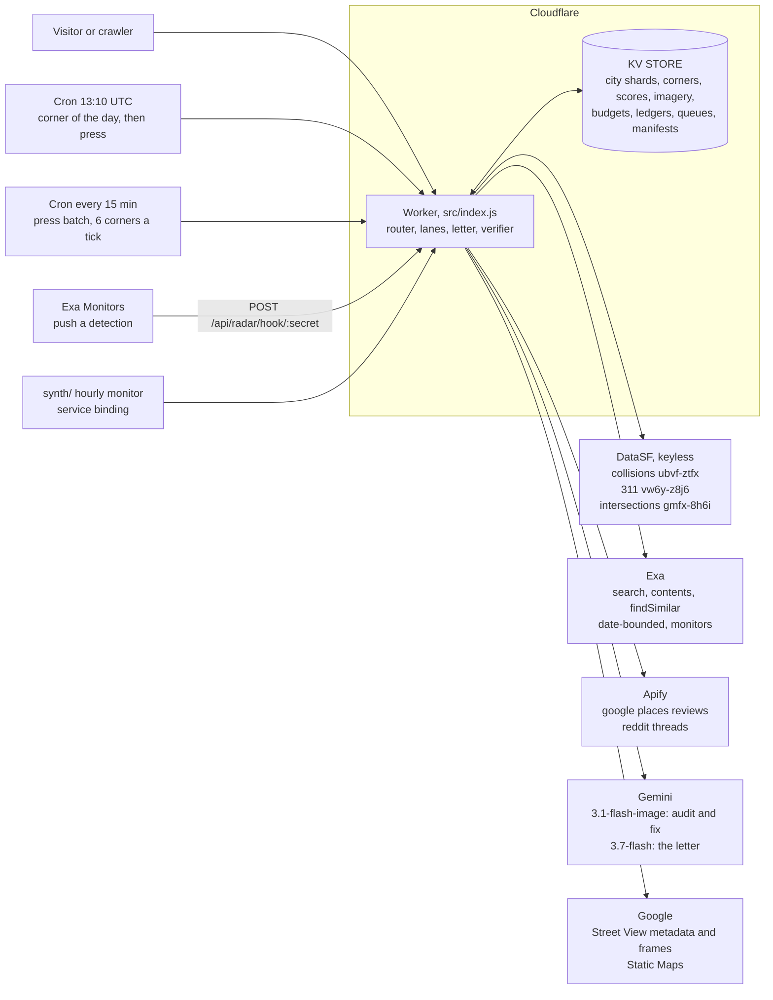

# Architecture

One Cloudflare Worker, no build step, no framework.

The tree below was written against `git ls-files` on 2026-08-20 rather than from memory. The version that stood here until 2026-08-19 was wrong in three ways and is worth naming, because it is the ordinary way a README rots: it omitted nineteen source files added after it was written, it pointed at `docs/` for the hero image that now lives in `assets/`, and it described `tools/` as holding two test files when it holds fourteen.

```
src/
  index.js          router, every data lane, both cron handlers, health, graceful degradation
  store.js          KV: corners, scores, imagery, budgets, cost ledgers, rate limits,
                    queues, run manifests, press records, the audit log

  page.js           one corner, as one HTML string, plus the CSS every other page imports
  home.js           the city map and the scoreboard
  city.js           the graded city, read from KV shards, plus the tier vocabulary
  methodology.js    /methodology, the arithmetic and the limits in prose
  watchlistpage.js  /watchlist, entries and rejects together
  radarpage.js      /radar, the standing monitors and what they caught
  status.js         /status, uptime, verifier incidents and the cost ledgers
  changes.js        /changes, every stored grade movement
  watchdog.js       /watchdog, what the autonomous agent decided and why

  resolve.js        free text to a corner: normalizing, DataSF lookup, districts
  score.js          the Danger Index, DataSF arithmetic only, no model
  distribution.js   the frozen census, 8,254 values, dated and declared final
  data.js           corner registry, Supervisor roster, 311 allow list, samples

  press.js          entity discovery over citywide coverage: the watchlist builder
  pressenrich.js    the frugal per-corner press check, one search, tier untouched
  newsfilter.js     the press relevance filter, one copy, several callers
  radar.js          standing Exa monitors and the webhook's filter
  timeline.js       the Exa time machine, one date-bounded search per year since 2014
  suggest.js        findSimilar to a related corner worth auditing next
  voices.js         resident voices, commissioned through Apify and normalized

  imagery.js        on-demand Street View and Gemini generation, never blocking a page
  hazards.js        the structured audit pass and the deterministic corroboration rule
  cred.js           four lanes to one verdict, no model
  verify.js         the letter verifier: deterministic, and it can refuse to serve
  impact.js         the projection engine over the CMF table, ranges only
  manifest.js       what each tool actually did on this corner
  agent.js          the Corner Watchdog's ingest boundary

tools/    61 tracked files: 36 scripts, 14 test files, 8 recorded fixtures, 3 shared
          modules in tools/lib/. `node --test tools/*.test.mjs`
public/   20 tracked files: logos, wordmark, grade cards, the typeahead and map
          scripts. Wrangler reports 24 because it counts the four subdirectories
assets/   the README hero composite
data/     committed sweep artifacts: city meta, twin slugs, the CMF table, precedents
synth/    the hourly synthetic monitor, its own Worker
specs/    handoff and working notes
docs/     prose written alongside the code, including the full counts derivation
```



Every provider lane is optional at request time. A lane that fails answers with its labelled degraded state instead of an error, so a panel is never dead and a page never half renders.

**Imagery lives in KV, not in the repo.** Generated frames are 700 to 830KB each and there is no reason to carry them in git. Every corner, precomputed or typed, serves its three states from KV through the edge cache on one code path.

**Caching, in two layers.** An in-process `Map` sits inside the Worker isolate, and a Cloudflare edge cache (`caches.default`) sits in front of it. The second layer is the one that matters: Worker isolates are short lived and per-colo, so warming the in-process map does nothing for the next visitor, who usually lands on a cold isolate and pays the full upstream cost again. With the edge cache in place every lane on both corners returns in under 0.26s, and the letter went from about 7s to 0.16s.

Two deliberate rules govern it. **Sample and empty payloads are never cached**, so a lane that failed once is retried on the next request rather than pinned in that state for an hour. And what goes back to the browser is always `no-store` while the internally cached copy carries `max-age`: fast internally, never stale externally, so a data correction ships and actually shows up. A `CACHE_VERSION` constant invalidates every cached payload at once when the numbers change.

Adding a corner is one object in `CORNERS` plus one imagery run. What that object cannot do is paper over code that assumed one specific corner, which is what the second corner was for.
